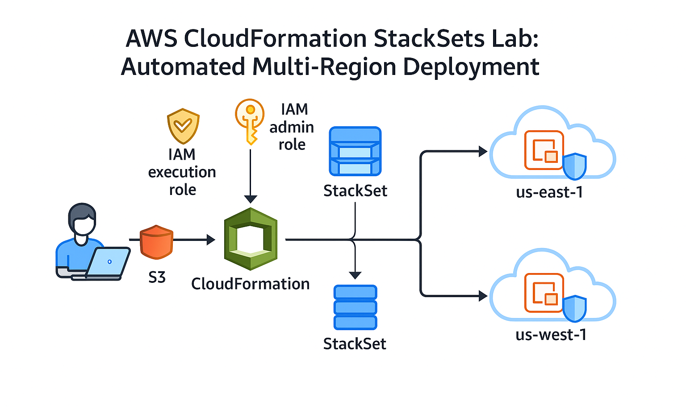

## AWS CloudFormation: Parameterized, Modular and Multi-Region IaC with StackSets.

Automating secure AWS infrastructure with modular CloudFormation templates, advanced parameterization, nested stacks and StackSets for scalable multi-region deployment.

---

## Table of Contents

- [Overview](#overview)
- [Real-World Risk](#real-world-risk)
- [What I Built](#what-i-built)
- [Diagram](#diagram)
- [Objectives](#objectives)
- [Steps Performed](#steps-performed)
  - [1. Project Setup]
  - [2. Parameterized Stack Deployment]
  - [3. Change Sets & Stack Updates]
  - [4. Nested Stacks for Modularity]
  - [5. Multi-Region Deployment with StackSets]
  - [6. Cleanup]
- [Screenshots](#screenshots)
- [Lessons Learned](#lessons-learned)
- [Important Security Note](#important-security-note)
- [Notes and Limitations](#notes-and-limitations)
- [References](#references)
- [Contact](#contact)

---

## Overview

This lab demonstrates modern Infrastructure as Code (IaC) on AWS using CloudFormation with:
- Secure, parameterized templates.
- Modular stack design with nested stacks.
- Automated deployment from PowerShell/CLI.
- Advanced features like Change Sets for safe updates.
- Enterprise-grade multi-region rollouts with StackSets.

---

## Real-World Risk

Without modular and parameterized IaC:
- Infrastructure is hard to scale and audit.
- Manual changes lead to configuration drift and risk.
- Lack of safe change previews can break production.
- Multi-region/cloud expansion is slow and error-prone.

---

## What I Built

A full AWS CloudFormation automation lab that:
- Structures CloudFormation templates for reuse and parameterization.
- Uses PowerShell/CLI for deployment and validation.
- Implements Change Sets for safe, auditable stack updates.
- Leverages Nested Stacks for code modularity and DRY principles.
- Deploys infrastructure across multiple regions with StackSets.

---

## Diagram

---

## Objectives

- Author secure, parameterized CloudFormation templates.
- Use Change Sets for safe, visible infrastructure updates.
- Modularize templates via Nested Stacks for clean architecture.
- Deploy infrastructure to multiple regions using StackSets.
- Validate and document the entire IaC lifecycle.

---

## Steps Performed

**1. Project Setup**
   - Organized a root folder with `templates/`, `parameters/` and script directories.
   - Installed AWS CLI and verified permissions *(Screenshot: `project_structure.png`)*

**2. Parameterized Stack Deployment**
   - Authored and validated a CloudFormation template for EC2 using parameters for type, key and tags.
   - Created parameter JSON files for environment-specific deployments.
   - Deployed stack from PowerShell/CLI with parameter files *(Screenshots: `cli_stack_creation.png`, `parameters_json.png` & `ec2_instance.png`)*

**3. Change Sets & Stack Updates**
   - Used Change Sets to preview changes before applying stack updates (e.g., EC2 type upgrades)
   - Demonstrated safe, auditable change previews *(Screenshots: `change_set_preview.png` & `change_set_applied.png`)*

**4. Nested Stacks for Modularity**
   - Split template into nested stacks (e.g., separate security group stack)
   - Showed how to reference nested stacks for scalable architectures *(Screenshots: `nested_template_editor.png`, `security_group.png` & `nested_stack_console.png`)*

**5. Multi-Region Deployment with StackSets**
   - Uploaded finalized template to S3 for organization-wide access.
   - Used CloudFormation StackSets to deploy the stack in additional regions (e.g., us-west-1)
   - Validated success and troubleshooting steps *(Screenshots: `stackset_multi_region.png` & `stack_success.png`)*

**6. Cleanup**
   - Removed stack instances, deleted StackSet, cleaned S3 bucket and any custom IAM/key pairs as needed.

---

## Screenshots

*All screenshots are included in the `screenshots/` folder.*

| Step |           Filename               | Description                                |
|------|----------------------------------|--------------------------------------------|
| 1    | project_structure.png            | Project folder/module structure            |
| 2    | parameters_json.png              | Environment parameters JSON                |
| 2    | cli_stack_creation.png           | Stack creation via CLI/PowerShell          |
| 2    | ec2_instance.png                 | EC2 instance created via CloudFormation    |
| 2    | ec2_instance_updated.png         | EC2 instance after type update             |
| 3    | change_set_preview.png           | Change Set diff preview in CloudFormation  |
| 3    | change_set_applied.png           | Change Set executed/applied                |
| 4    | nested_template_editor.png       | Editing nested stack template              |
| 4    | security_group.png               | Security group created by nested stack     |
| 4    | nested_stack_console.png         | Nested stack view in AWS Console           |
| 5    | stackset_multi_region.png        | StackSet deployed to multiple regions      |
| 5    | stack_success.png                | Stack instance with SUCCEEDED status       |
| -    | template_editor.png              | Template editor view                       |

---

## Lessons Learned

- Modular CloudFormation design is critical for scalable, maintainable IaC.
- Change Sets make cloud changes safer and more auditable than Bicep/Terraform.
- StackSets enable true enterprise multi-region/multi-account deployments.
- Detailed parameterization and validation avoids costly errors in prod.

---

## Important Security Note

**Security Considerations**
While this lab follows several security best practices—such as parameterizing sensitive values, using named IAM roles, leveraging Change Sets for infrastructure change control, and modularizing stacks for easier audit.**It also uses broad IAM permissions and open SSH rules for demo purposes.**

**For real-world production use, you should improve security in these areas:**

- **IAM Roles/Policies:** Replace 'AdministratorAccess' with least-privilege custom IAM policies for both StackSet administration and execution.

- **SSH Security Group Rules:** Avoid opening SSH (0.0.0.0/0) to the world. Restrict to your trusted IPs or use AWS Systems Manager Session Manager for remote access (no open ports).

- **Key Management:** Manage and rotate SSH key pairs centrally (e.g., with AWS Secrets Manager or SSM Parameter Store). Prefer EC2 Instance Connect or SSM Session Manager for remote access.

- **Parameterization and Secrets:** Never hardcode secrets. Continue to use parameters and store sensitive values in AWS Parameter Store or Secrets Manager where possible.

- **Template and Change Review:** Always use Change Sets before updates and enforce peer review for stack changes.

These improvements help ensure that your CloudFormation deployments are secure, auditable and compliant with best practices.

---

## Notes & Limitations

- AMI IDs and Key Pairs must exist in each target region for StackSets.
- StackSet permissions can be tricky—service-managed mode is easier for single accounts.
- Lab used broad IAM permissions for demo; restrict in production.
- Manual cleanup is essential to avoid AWS charges after testing.

---

## References

- [CloudFormation Documentation](https://docs.aws.amazon.com/AWSCloudFormation/latest/UserGuide/Welcome.html)
- [AWS CLI Reference](https://docs.aws.amazon.com/cli/latest/reference/)
- [StackSets Best Practices](https://docs.aws.amazon.com/AWSCloudFormation/latest/UserGuide/stacksets-bestpractices.html)
- [CloudFormation Change Sets](https://docs.aws.amazon.com/AWSCloudFormation/latest/UserGuide/using-cfn-updating-stacks-changesets.html)

---

## Contact

Sebastian Silva C. – August 2025 – Berlin, Germany  
- [LinkedIn](https://www.linkedin.com/in/sebastiansilc/)
- [GitHub](https://github.com/SebaSilC)
- [sebastian@playbookvisualarts.com](mailto:sebastian@playbookvisualarts.com)

